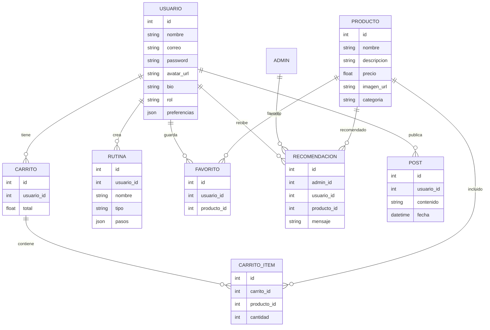

# Esquema de Base de Datos: Florecer

_¿Cuáles son las entidades principales y relaciones en tu modelo de datos?_

---

## Diagrama ER

<small>(Diagrama inicial. Amplía según evolucione el proyecto.)</small>

---

## Descripción

El modelo de datos de Florecer está centrado en el usuario, permitiendo personalización, recomendaciones y gestión de productos y rutinas. Los usuarios pueden registrar preferencias, crear rutinas de cuidado, guardar productos favoritos y realizar compras simuladas mediante carritos. Los administradores pueden ver perfiles y enviar recomendaciones personalizadas que aparecen en el carrito del usuario. La comunidad se fomenta mediante publicaciones (posts) y la posibilidad de interactuar con otros usuarios. Las relaciones entre entidades permiten una experiencia personalizada, flexible y escalable, alineada con los objetivos de bienestar y e-commerce de la plataforma.

<small>Agrega más entidades y relaciones a medida que tu proyecto crezca.</small>
